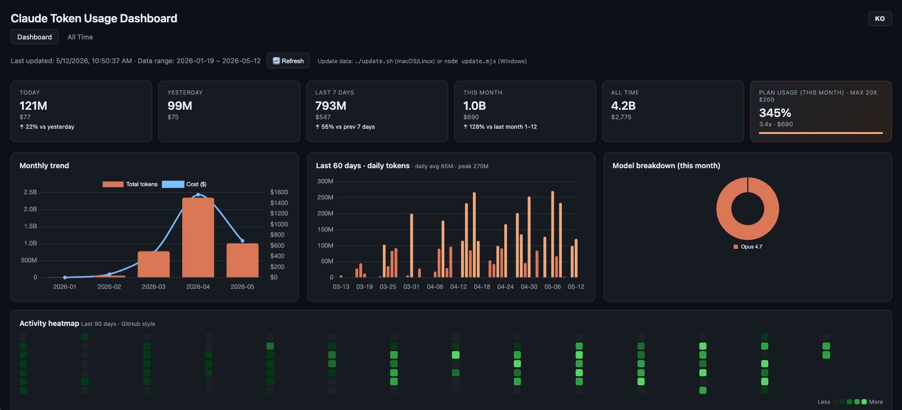
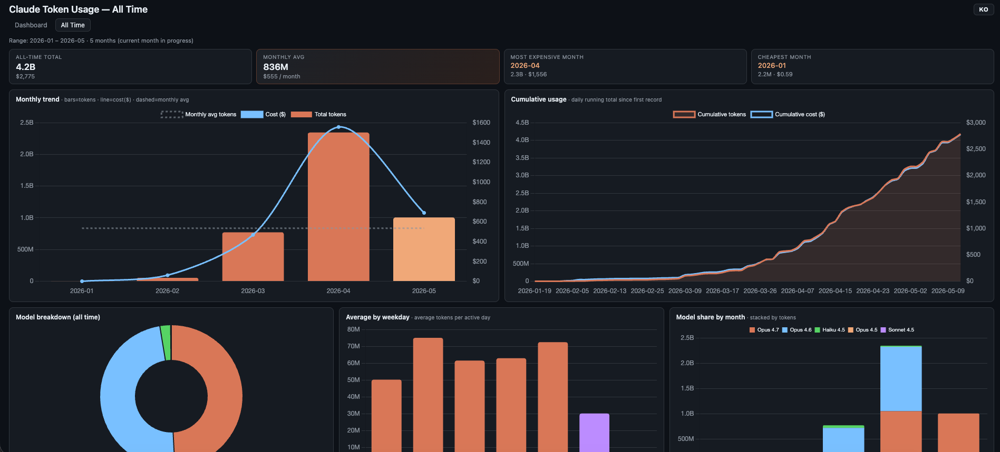
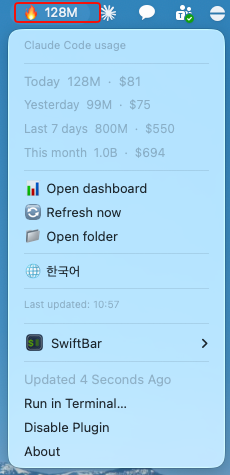

# cc-usage-board

[한국어](README.md) · **English**

A local dashboard that visualizes Claude Code token usage.



It renders JSON exported by [ccusage](https://github.com/ryoppippi/ccusage)
into a single HTML file with charts. The data update script is Node-based
so it **runs on macOS, Linux, and Windows**. macOS users also get a
SwiftBar plugin for at-a-glance menu bar stats.

> No data is sent to any external server. The generated files
> (`data*.json`, `data.js`) are listed in `.gitignore` so they will not
> be committed by accident.

## Bilingual UI

A `KO / EN` toggle in the top right of each dashboard page switches the
language instantly. Your choice is persisted in `localStorage`; on first
visit, the dashboard picks up your browser language. Number units adapt
to the locale as well (Korean uses `만/억`, English uses `K/M/B`).

## Platform compatibility

| Component | macOS | Linux | Windows |
| --- | :---: | :---: | :---: |
| `dashboard.html` (browser) | ✅ | ✅ | ✅ |
| `update.mjs` (data refresh) | ✅ | ✅ | ✅ |
| `update.sh` (convenience wrapper) | ✅ | ✅ | ❌ (call `node update.mjs` directly) |
| SwiftBar plugin (menu bar) | ✅ | ❌ | ❌ |

## What you get

The top nav switches between two pages.

### `dashboard.html` — Overview
- **Stat cards**: today / yesterday / last 7 days / this month / all-time / plan usage
- **Monthly trend**: total tokens + cost ($)
- **Last 60 days** daily-tokens bar chart
- **Activity heatmap**: last 90 days (GitHub style)
- **Model breakdown** doughnut for the current month
- **Last 30 days daily detail** table

### `overview.html` — All Time



- **Aggregate cards**: all-time total / **monthly average** (tokens+cost) / most expensive month / cheapest month
- **Monthly trend chart**: bars (tokens) + line (cost) + dashed (monthly average)
- **Cumulative usage curve**: daily running total since first record (tokens area + cost line)
- **All-time model breakdown** doughnut (summed across months)
- **Average by weekday** bar chart (per-active-day, weekend color-coded)
- **Model share by month** stacked bar (model mix evolution over time)
- **Monthly detail table**: month / total tokens / total cost / active days / daily avg / vs prev month / models

> Compact layout designed to fit a single viewport (2-col + 3-col + compact table).

## Requirements

| Tool | Notes |
| --- | --- |
| [Node.js](https://nodejs.org/) 18+ | Used via `npx` to run ccusage |
| [Claude Code](https://docs.claude.com/claude-code) | ccusage reads its local logs from `~/.claude/` |
| [jq](https://jqlang.github.io/jq/) (optional) | For the SwiftBar plugin. `brew install jq` |
| [SwiftBar](https://swiftbar.app/) (optional, macOS) | For the menu bar plugin |

## Install

### macOS / Linux

```bash
git clone https://github.com/huhjayeon/cc-usage-board.git ~/claude-dashboard
cd ~/claude-dashboard
chmod +x update.sh update.mjs plugins/claude-usage.5m.sh test.sh
./update.sh           # First data pull (npx fetches ccusage, ~30s–1m)
open dashboard.html   # macOS. On Linux: xdg-open dashboard.html
```

### Windows (PowerShell)

```powershell
git clone https://github.com/huhjayeon/cc-usage-board.git $HOME\claude-dashboard
cd $HOME\claude-dashboard
node update.mjs       # First data pull
start dashboard.html  # Opens in the default browser
```

On WSL, follow the macOS/Linux steps as-is.

The very first run downloads ccusage via `npx`. You are ready once
`data-daily.json`, `data-monthly.json`, `data-session.json`, and
`data.js` appear in the folder.

## Refreshing data

The **Refresh** button in the dashboard only reloads the page. To pull
fresh numbers, re-run the update script.

```bash
# macOS / Linux
~/claude-dashboard/update.sh

# Windows
node $HOME\claude-dashboard\update.mjs
```

To refresh on a schedule:

- macOS / Linux (cron):
  ```
  */5 * * * * $HOME/claude-dashboard/update.sh >/dev/null 2>&1
  ```
- Windows (Task Scheduler): create a "Start a program" task with
  `node` as the program, `update.mjs` as the argument, and
  `%USERPROFILE%\claude-dashboard` as the working directory.

## SwiftBar plugin (macOS only)



Displays today's tokens/cost in the menu bar and auto-refreshes every
5 minutes. The leading emoji reflects workload intensity
(💤 / 🟢 / 🟡 / 🟠 / 🔥).

```bash
brew install --cask swiftbar
brew install jq

ln -s ~/claude-dashboard/plugins/claude-usage.5m.sh \
      ~/Library/Application\ Support/SwiftBar/Plugins/claude-usage.5m.sh
```

Menu entries:
- Today / yesterday / last 7 days / this month — tokens · cost
- **Open dashboard** — opens `dashboard.html` in the browser
- **Refresh now** — runs `update.sh` immediately
- **Open folder** — opens the project folder
- **🌐 한국어 / 🌐 English** — one-click language switch

### Plugin language settings

Besides the in-menu toggle, you can pin a language via (highest priority first):

1. **SwiftBar variable** — plugin settings → Variables → `CC_USAGE_LANG=ko`
2. **File** — `echo ko > ~/.claude-dashboard-lang`
3. **System locale** — `$LANG` starting with `ko_*` selects KO, otherwise EN
4. Default is English

Number units follow the locale (KO: `만/억`, EN: `K/M/B`).

## File guide

| File | Role |
| --- | --- |
| `dashboard.html` | Main UI — overview (Chart.js via CDN) |
| `overview.html` | All Time — 5 charts + monthly detail table |
| `i18n.js` | Korean/English translation + number formatter + language toggle |
| `shared.js` | Shared helpers (`modelShort`, `modelTokens`, `el`, `CHART_THEME`, `CHART_COLORS`) |
| `styles.css` | Shared design tokens (CSS variables) + model pills + utility classes |
| `update.mjs` | Calls ccusage → writes `data*.json` / `data.js` (cross-platform) |
| `update.sh` | Convenience wrapper for macOS/Linux that calls `update.mjs` |
| `plugins/claude-usage.5m.sh` | SwiftBar menu bar plugin (macOS only) |
| `test.sh` | Smoke tests (syntax / tag balance / i18n parity / file refs) |
| `data.js`, `data-*.json` | Generated data (gitignored) |

## Development / testing

Run `./test.sh` to smoke-test after any change. It covers:

- JS / shell syntax (`node --check`, `bash -n`)
- HTML inline script syntax
- HTML tag balance
- i18n key parity (`ko ≡ en`, every key used in HTML is defined, no orphans)
- Required external file references

```bash
./test.sh
# PASS: 16 / FAIL: 0
```

## Troubleshooting

**`command not found: node` / `npx`**
Node.js isn't installed. Use the [official installer](https://nodejs.org/),
`brew install node` on macOS, or `winget install OpenJS.NodeJS` on Windows.

**`update.mjs` produces an empty dataset**
You have no Claude Code local logs yet. Use Claude Code at least once so
records pile up in `~/.claude/` (macOS/Linux) or `%USERPROFILE%\.claude\`
(Windows). See the
[ccusage README](https://github.com/ryoppippi/ccusage) for what it requires.

**Charts are empty in the dashboard**
- Confirm `data.js` was generated.
- Open the browser console (⌥⌘I / F12) and check `window.CLAUDE_DATA`.
- Some browsers block `<script src="data.js">` over `file://`. Serve
  the folder over HTTP instead:
  ```bash
  python3 -m http.server 8000
  # Then open http://localhost:8000/dashboard.html
  ```

**The language toggle doesn't stick**
Some browsers block `localStorage` over `file://`. Serving the folder
via a local server (see above) fixes it.

**SwiftBar plugin only shows `🤖 jq needed`**
`brew install jq`, then choose "Refresh All" from the SwiftBar menu.

**PowerShell execution policy error on Windows**
`update.mjs` is a Node script, not a PowerShell script, so execution
policy doesn't apply. Invoke it as `node update.mjs`.

## License

MIT — see [LICENSE](LICENSE).

Internally calls [ccusage](https://github.com/ryoppippi/ccusage) (MIT).
Charts powered by [Chart.js](https://www.chartjs.org/) (MIT).
