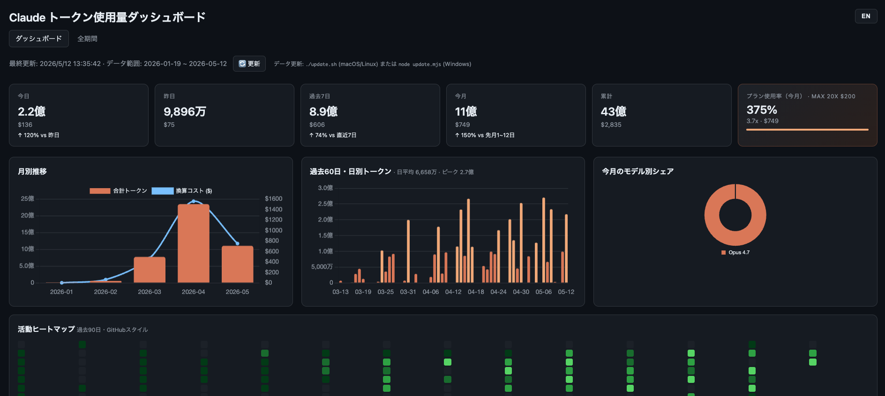
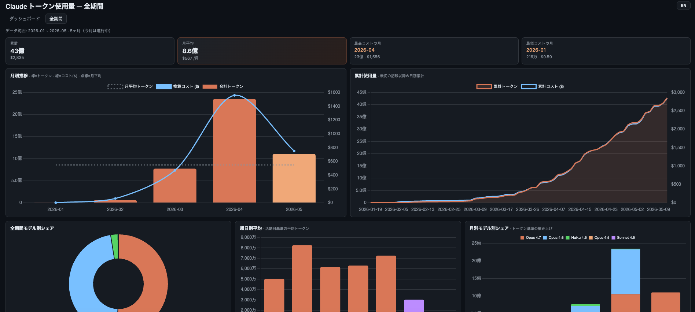
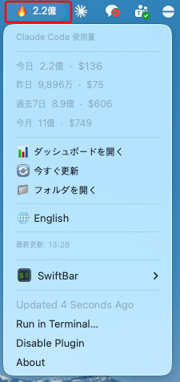

# cc-usage-board

[English](README.md) · [한국어](README.ko.md) · **日本語**

Claude Code のトークン使用量を可視化するローカルダッシュボード。



[ccusage](https://github.com/ryoppippi/ccusage) が出力する JSON を単一の HTML
ファイルでチャート化します。データ更新スクリプトは Node ベースなので
**macOS / Linux / Windows すべてで動作**します。macOS ユーザー向けには、
メニューバーから一目で確認できる SwiftBar プラグインも同梱しています。

> データを外部サーバーに送信しません。生成ファイル(`data*.json`, `data.js`)
> は `.gitignore` に含まれているため、誤ってコミットされることもありません。

## 多言語 UI

各ダッシュボードページ右上の `KO / JA / EN` トグルで、韓国語・日本語・英語を
即座に切り替えられます。選択した言語は `localStorage` に保存され、初回訪問時
はブラウザの言語設定に従います。数値単位もロケールに合わせて変化します
(韓国語: `만/억`, 日本語: `万/億`, 英語: `K/M/B`)。

## 対応プラットフォーム

| コンポーネント | macOS | Linux | Windows |
| --- | :---: | :---: | :---: |
| `dashboard.html` (ブラウザ) | ✅ | ✅ | ✅ |
| `update.mjs` (データ更新) | ✅ | ✅ | ✅ |
| `update.sh` (便利ラッパー) | ✅ | ✅ | ❌ (`node update.mjs` を直接実行) |
| SwiftBar プラグイン (メニューバー) | ✅ | ❌ | ❌ |

## 画面構成

上部のナビゲーションで 2 つのページを切り替えできます。

### `dashboard.html` — 概要

- **統計カード**: 今日 / 昨日 / 過去7日 / 今月 / 累計 / プラン使用率
- **月別推移**: 合計トークン + コスト換算 ($)
- **過去60日** の日別トークン棒グラフ
- **活動ヒートマップ**: 過去90日 (GitHub スタイル)
- **モデル別シェア** ドーナツチャート (今月)
- **過去30日 日別詳細** テーブル

### `overview.html` — 全期間



- **集計カード**: 累計 / **月平均** (トークン+コスト) / 最高コストの月 / 最低コストの月
- **月別推移チャート**: 棒 (トークン) + 線 (コスト) + 点線 (月平均)
- **累計使用量カーブ**: 最初の記録以降の日別累計 (トークン領域 + コスト線)
- **全期間モデル別シェア** ドーナツ (全月集計)
- **曜日別平均** 棒グラフ (活動日基準、週末は色分け)
- **月別モデル別シェア** 積み上げ棒グラフ (時系列でのモデル構成変化)
- **月別詳細テーブル**: 月 / 合計トークン / 合計コスト / 活動日数 / 日平均 / 前月比 / モデル

> 1 つのビューポートに収まるように設計されたコンパクトレイアウト
> (2 列 + 3 列 + コンパクトテーブル)。

## 必要環境

| ツール | 備考 |
| --- | --- |
| [Node.js](https://nodejs.org/) 18+ | `npx` で ccusage を実行 |
| [Claude Code](https://docs.claude.com/claude-code) | ccusage は `~/.claude/` のローカルログを読み込みます |
| [jq](https://jqlang.github.io/jq/) (オプション) | SwiftBar プラグイン用。`brew install jq` |
| [SwiftBar](https://swiftbar.app/) (オプション、macOS) | メニューバープラグイン用 |

## インストール

### macOS / Linux

```bash
git clone https://github.com/huhjayeon/cc-usage-board.git ~/claude-dashboard
cd ~/claude-dashboard
chmod +x update.sh update.mjs plugins/claude-usage.5m.sh test.sh
./update.sh           # 初回データ取得 (npx が ccusage を取得、30秒〜1分)
open dashboard.html   # macOS。Linux: xdg-open dashboard.html
```

### Windows (PowerShell)

```powershell
git clone https://github.com/huhjayeon/cc-usage-board.git $HOME\claude-dashboard
cd $HOME\claude-dashboard
node update.mjs       # 初回データ取得
start dashboard.html  # 既定のブラウザで開く
```

WSL の場合は macOS/Linux の手順に従ってください。

初回実行時、`npx` が ccusage をダウンロードします。`data-daily.json`,
`data-monthly.json`, `data-session.json`, `data.js` がフォルダに生成されたら
準備完了です。

## データの更新

ダッシュボードの **更新** ボタンはページを再読み込みするだけです。最新の
数値を取得するには、更新スクリプトを再実行してください。

```bash
# macOS / Linux
~/claude-dashboard/update.sh

# Windows
node $HOME\claude-dashboard\update.mjs
```

定期実行する場合:

- macOS / Linux (cron):
  ```
  */5 * * * * $HOME/claude-dashboard/update.sh >/dev/null 2>&1
  ```
- Windows (タスクスケジューラ): "プログラムの開始" タスクで
  プログラム `node`、引数 `update.mjs`、開始場所 `%USERPROFILE%\claude-dashboard`
  を指定。

## SwiftBar プラグイン (macOS 専用)



メニューバーに今日のトークン/コストを表示し、5 分ごとに自動更新します。
作業強度に応じて先頭の絵文字が変化します (💤 / 🟢 / 🟡 / 🟠 / 🔥)。

```bash
brew install --cask swiftbar
brew install jq

ln -s ~/claude-dashboard/plugins/claude-usage.5m.sh \
      ~/Library/Application\ Support/SwiftBar/Plugins/claude-usage.5m.sh
```

メニュー項目:
- 今日 / 昨日 / 過去7日 / 今月 — トークン・コスト
- **ダッシュボードを開く** — `dashboard.html` をブラウザで開く
- **今すぐ更新** — `update.sh` を即時実行
- **フォルダを開く** — プロジェクトフォルダを開く
- **🌐 한국어 / 日本語 / English** — ワンクリック言語サイクル (KO → JA → EN)

### プラグインの言語設定

メニュー内トグル以外にも、以下の方法で言語を固定できます (優先度高→低):

1. **SwiftBar 変数** — プラグイン設定 → Variables → `CC_USAGE_LANG=ja` (または `ko` / `en`)
2. **ファイル** — `echo ja > ~/.claude-dashboard-lang` (または `ko` / `en`)
3. **システムロケール** — `$LANG` が `ja_*` で始まれば JA、`ko_*` なら KO、それ以外は EN
4. デフォルトは英語

数値単位もロケールに連動します (KO: `만/억`, JA: `万/億`, EN: `K/M/B`)。

## ファイル構成

| ファイル | 役割 |
| --- | --- |
| `dashboard.html` | メイン UI — 概要 (Chart.js を CDN 経由) |
| `overview.html` | 全期間 — 5 種類のチャート + 月別詳細テーブル |
| `i18n.js` | 韓国語 / 日本語 / 英語の翻訳 + 数値フォーマッタ + 言語サイクル |
| `shared.js` | 共通ヘルパー (`modelShort`, `modelTokens`, `el`, `CHART_THEME`, `CHART_COLORS`) |
| `styles.css` | 共有デザイントークン (CSS 変数) + モデルピル + ユーティリティクラス |
| `update.mjs` | ccusage 呼び出し → `data*.json` / `data.js` を出力 (クロスプラットフォーム) |
| `update.sh` | macOS/Linux 向けの便利ラッパー。内部で `update.mjs` を呼び出し |
| `plugins/claude-usage.5m.sh` | SwiftBar メニューバープラグイン (macOS 専用) |
| `test.sh` | スモークテスト (文法 / タグバランス / i18n 整合 / 外部参照) |
| `data.js`, `data-*.json` | 生成データ (gitignore) |

## 開発 / テスト

変更後は `./test.sh` でスモークテストを実行できます。チェック内容:

- JS / シェルスクリプトの文法 (`node --check`, `bash -n`)
- HTML インラインスクリプトの文法
- HTML タグバランス
- i18n キー整合性 (`ko ≡ ja ≡ en`、HTML で使われているキーがすべて定義されている、未使用キーなし)
- 必要な外部ファイル参照

```bash
./test.sh
# PASS: 16 / FAIL: 0
```

## トラブルシューティング

**`command not found: node` / `npx`**
Node.js がインストールされていません。[公式インストーラ](https://nodejs.org/)、
macOS なら `brew install node`、Windows なら `winget install OpenJS.NodeJS`。

**`update.mjs` で空のデータしか出力されない**
Claude Code のローカルログがまだありません。Claude Code を一度でも使用すると
`~/.claude/` (macOS/Linux) または `%USERPROFILE%\.claude\` (Windows) に
記録が蓄積されます。ccusage の動作条件は
[ccusage README](https://github.com/ryoppippi/ccusage) を参照してください。

**ダッシュボードでチャートが空に見える**
- `data.js` が生成されているか確認
- ブラウザのコンソール (⌥⌘I / F12) で `window.CLAUDE_DATA` を確認
- 一部のブラウザは `file://` で `<script src="data.js">` をブロックします。
  ローカルサーバーで配信してください:
  ```bash
  python3 -m http.server 8000
  # http://localhost:8000/dashboard.html を開く
  ```

**言語トグルが保存されない**
`file://` で `localStorage` をブロックするブラウザがあります。
上記と同様にローカルサーバー経由でアクセスすれば解決します。

**SwiftBar プラグインに `🤖 jq が必要` しか表示されない**
`brew install jq` を実行後、SwiftBar メニューで "Refresh All" を選択。

**Windows PowerShell で実行ポリシーエラー**
`update.mjs` は PowerShell スクリプトではなく Node スクリプトなので、
実行ポリシーは無関係です。`node update.mjs` で呼び出してください。

## ライセンス

MIT — 詳細は [LICENSE](LICENSE) を参照。

内部で [ccusage](https://github.com/ryoppippi/ccusage) (MIT) を呼び出しています。
チャートは [Chart.js](https://www.chartjs.org/) (MIT) を使用。
