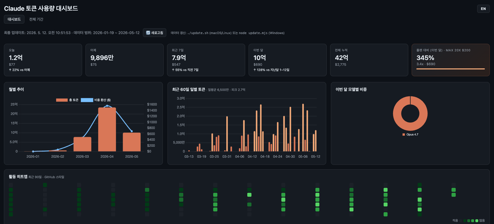
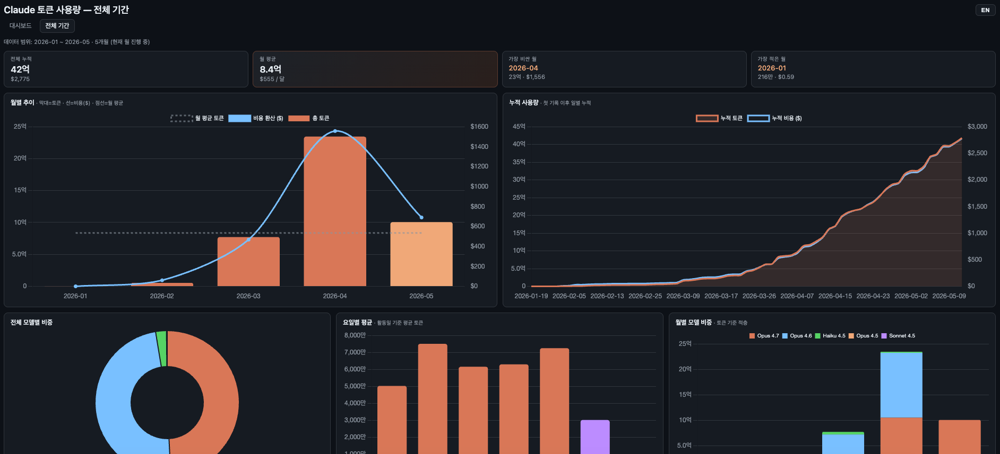
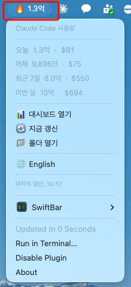

# cc-usage-board

[English](README.md) · **한국어** · [日本語](README.ja.md)

Claude Code 토큰 사용량을 시각화하는 로컬 대시보드.



[ccusage](https://github.com/ryoppippi/ccusage)가 내보낸 JSON을 단일 HTML
파일에서 차트로 그려준다. 데이터 갱신 스크립트는 Node 기반이라
**macOS / Linux / Windows 모두에서 동작**한다. macOS 한정으로 메뉴바에서
바로 확인할 수 있는 SwiftBar 플러그인도 들어 있다.

> 외부 서버에 데이터를 보내지 않는다. 생성된 데이터(`data*.json`,
> `data.js`)는 `.gitignore`에 포함되어 있어 실수로 커밋되지 않는다.

## 다국어 지원

대시보드 우상단의 `KO / JA / EN` 토글로 한국어/일본어/영어를 즉시 사이클할 수 있다.
선택한 언어는 브라우저 `localStorage`에 저장되며, 처음 방문 시에는 브라우저
언어 설정을 따른다. 숫자 단위도 함께 바뀐다 (한국어 `만/억`, 일본어 `万/億`, 영어 `K/M/B`).

## 플랫폼 호환성

| 컴포넌트 | macOS | Linux | Windows |
| --- | :---: | :---: | :---: |
| `dashboard.html` (브라우저) | ✅ | ✅ | ✅ |
| `update.mjs` (데이터 갱신) | ✅ | ✅ | ✅ |
| `update.sh` (편의 래퍼) | ✅ | ✅ | ❌ (직접 `node update.mjs` 실행) |
| SwiftBar 플러그인 (메뉴바) | ✅ | ❌ | ❌ |

## 화면 구성

상단 네비게이션에서 두 페이지를 전환할 수 있다.

### `dashboard.html` — 전체 개요
- **카드**: 오늘 / 어제 / 최근 7일 / 이번 달 / 누적 / 플랜 대비 사용률
- **월별 추이**: 총 토큰 + 비용 환산 ($)
- **최근 60일 일별 토큰** 차트
- **활동 히트맵**: 최근 90일 (GitHub 스타일)
- **이번 달 모델별 비중** 도넛 차트
- **최근 30일 일별 상세** 테이블

### `overview.html` — 전체 기간



- **집계 카드**: 전체 누적 / **월 평균** (토큰+비용) / 가장 비싼 월 / 가장 적은 월
- **월별 추이 차트**: 막대(토큰) + 선(비용) + 점선(월 평균)
- **누적 사용량 곡선**: 첫 기록 이후 일별 누적 토큰(영역) + 누적 비용(선)
- **전체 모델별 비중** 도넛 (모든 월 합산)
- **요일별 평균** 막대 차트 (활동일 기준, 주말 색상 구분)
- **월별 모델 비중 변화** 스택드 바 (모델 점유율 시간 추이)
- **월별 상세 테이블**: 월 / 총 토큰 / 총 비용 / 활동일 / 일평균 / 전월 대비 / 모델

> 한 화면에 모두 들어오도록 압축 레이아웃 적용 (2-col + 3-col + 컴팩트 테이블).

## 요구사항

| 항목 | 비고 |
| --- | --- |
| [Node.js](https://nodejs.org/) 18+ | `npx`로 ccusage 실행 |
| [Claude Code](https://docs.claude.com/claude-code) | ccusage가 읽을 로컬 로그가 있어야 함 (`~/.claude/`) |
| [jq](https://jqlang.github.io/jq/) (선택) | SwiftBar 플러그인용. `brew install jq` |
| [SwiftBar](https://swiftbar.app/) (선택, macOS) | 메뉴바 플러그인용 |

## 설치

### macOS / Linux

```bash
git clone https://github.com/huhjayeon/cc-usage-board.git ~/claude-dashboard
cd ~/claude-dashboard
chmod +x update.sh update.mjs plugins/claude-usage.5m.sh test.sh
./update.sh           # 데이터 첫 생성 (npx가 ccusage를 자동 설치, 30초~1분)
open dashboard.html   # macOS. Linux는 xdg-open dashboard.html
```

### Windows (PowerShell)

```powershell
git clone https://github.com/huhjayeon/cc-usage-board.git $HOME\claude-dashboard
cd $HOME\claude-dashboard
node update.mjs       # 데이터 첫 생성
start dashboard.html  # 기본 브라우저로 열기
```

WSL을 쓰는 경우 macOS/Linux 절차를 그대로 따르면 된다.

처음 실행 시 `npx`가 ccusage를 다운로드한다. `data-daily.json`,
`data-monthly.json`, `data-session.json`, `data.js`가 생성되면 준비 완료.

## 데이터 갱신

대시보드 우상단의 **새로고침** 버튼은 페이지를 다시 로드만 한다. 실제
데이터를 새로 받으려면 갱신 스크립트를 다시 돌려야 한다.

```bash
# macOS / Linux
~/claude-dashboard/update.sh

# Windows
node $HOME\claude-dashboard\update.mjs
```

주기적으로 돌리고 싶다면:

- macOS / Linux (cron):
  ```
  */5 * * * * $HOME/claude-dashboard/update.sh >/dev/null 2>&1
  ```
- Windows (작업 스케줄러): "프로그램 시작" 작업에 `node`,
  인수 `update.mjs`, 시작 위치 `%USERPROFILE%\claude-dashboard` 지정.

## SwiftBar 플러그인 (macOS 전용)



메뉴바에 오늘 토큰/비용을 표시하고 5분마다 자동 갱신한다. 작업량에 따라
이모지가 바뀐다 (💤 / 🟢 / 🟡 / 🟠 / 🔥).

```bash
brew install --cask swiftbar
brew install jq

ln -s ~/claude-dashboard/plugins/claude-usage.5m.sh \
      ~/Library/Application\ Support/SwiftBar/Plugins/claude-usage.5m.sh
```

메뉴 항목:
- 오늘 / 어제 / 최근 7일 / 이번 달 토큰·비용
- **대시보드 열기** — `dashboard.html`을 브라우저에서 열기
- **지금 갱신** — `update.sh` 즉시 실행
- **폴더 열기** — 프로젝트 폴더 열기
- **🌐 한국어 / 日本語 / English** — 한 번 클릭마다 언어 사이클 (KO → JA → EN)

### 플러그인 언어 설정

메뉴의 토글 외에 다음 방법으로도 언어를 고정할 수 있다 (우선순위 순):

1. **SwiftBar 변수** — 플러그인 설정 → Variables → `CC_USAGE_LANG=ko` (또는 `ja` / `en`)
2. **파일** — `echo ko > ~/.claude-dashboard-lang` (또는 `ja` / `en`)
3. **시스템** — `$LANG`이 `ko_*`이면 KO, `ja_*`이면 JA, 그 외 EN
4. 기본값은 영어

숫자 단위도 함께 바뀐다 (KO: `만/억`, JA: `万/億`, EN: `K/M/B`).

## 파일별 역할

| 파일 | 역할 |
| --- | --- |
| `dashboard.html` | 메인 UI — 전체 개요 (Chart.js CDN) |
| `overview.html` | 전체 기간 — 차트 5개 + 월별 상세 테이블 |
| `i18n.js` | 한국어/일본어/영어 번역 + 숫자 포맷터 + 언어 사이클 |
| `shared.js` | 양쪽 페이지에서 쓰는 헬퍼 (`modelShort`, `modelTokens`, `el`, `CHART_THEME`, `CHART_COLORS`) |
| `styles.css` | 공유 디자인 토큰 (CSS 변수) + 모델 pill / 공통 유틸 클래스 |
| `update.mjs` | ccusage 호출 → `data*.json` / `data.js` 생성 (크로스플랫폼) |
| `update.sh` | macOS/Linux용 편의 래퍼. 내부적으로 `update.mjs` 호출 |
| `plugins/claude-usage.5m.sh` | SwiftBar 메뉴바 플러그인 (macOS 전용) |
| `test.sh` | 스모크 테스트 (문법/태그/i18n 정합/파일 참조) |
| `data.js`, `data-*.json` | 생성된 데이터 (gitignore) |

## 개발 / 테스트

코드를 수정한 뒤 `./test.sh`로 스모크 테스트를 돌릴 수 있다. 검사 항목:

- JS / 셸 스크립트 문법 (`node --check`, `bash -n`)
- HTML 인라인 스크립트 문법
- HTML 태그 균형
- i18n 키 정합성 (`ko ≡ ja ≡ en`, HTML에 쓰인 키 모두 정의됨, 미사용 키 없음)
- 외부 파일 참조 정상

```bash
./test.sh
# PASS: 16 / FAIL: 0
```

## 트러블슈팅

**`command not found: node` / `npx`**
Node.js 미설치. [공식 설치](https://nodejs.org/) 또는 macOS는 `brew install node`,
Windows는 `winget install OpenJS.NodeJS`.

**`update.mjs` 실행 시 빈 데이터만 나옴**
Claude Code 로컬 로그가 없는 것. Claude Code를 한 번이라도 써야
`~/.claude/`(macOS/Linux) 또는 `%USERPROFILE%\.claude\`(Windows)에 사용
기록이 쌓인다. ccusage 동작 조건은
[ccusage README](https://github.com/ryoppippi/ccusage) 참고.

**대시보드에서 차트가 비어 보인다**
- `data.js`가 생성됐는지 확인
- 브라우저 콘솔(⌥⌘I / F12)에서 `window.CLAUDE_DATA` 출력 확인
- 일부 브라우저는 `file://` 프로토콜에서 `<script src="data.js">`를
  차단할 수 있다. 그럴 땐 로컬 서버로 띄우자:
  ```bash
  python3 -m http.server 8000
  # 브라우저에서 http://localhost:8000/dashboard.html
  ```

**언어 토글이 동작하지 않는다**
`file://` 환경에서 `localStorage`를 막는 브라우저가 있다. 위 트러블슈팅과
동일하게 로컬 서버로 띄워서 접속하면 정상 동작한다.

**SwiftBar 플러그인에 `🤖 jq 필요`만 보인다**
`brew install jq` 후 SwiftBar 메뉴에서 "Refresh All".

**Windows PowerShell에서 실행 정책 오류**
`update.mjs`는 PowerShell 스크립트가 아니라 Node 스크립트라 실행 정책과
무관하다. `node update.mjs` 형태로 호출하면 된다.

## 라이선스

MIT — 자세한 내용은 [LICENSE](LICENSE).

내부적으로 [ccusage](https://github.com/ryoppippi/ccusage) (MIT)를 호출한다.
차트는 [Chart.js](https://www.chartjs.org/) (MIT) 사용.
